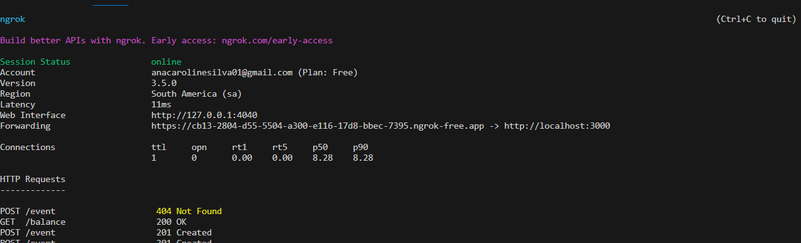

### Node.js Express API with Ngrok Tunnel

Hello! Are you a pretty cool developer, right? I'm sure you are. This is a simple API built with Node.js and Ngrok. Here, you can find straightforward explanations on how to set up this app in your VS Code or your favorite IDE.

### STEP 1:

First, you need to install Node on your computer system. You can download it from this link: https://nodejs.org/en. With Node, you can use npm to handle various commands in your VS Code terminal.

### STEP 2: 

You also need to create an Ngrok account. You can do that here. After that, in a command prompt, run the following command: ngrok authtoken (you can obtain this authtoken after creating an Ngrok account by accessing the option 'Your Authtoken' in the side navigation).

### STEP 3

Clone this repository to your PC.

### STEP 4:

Open this project in your VS Code and run npm install in the command line.

### STEP 5:

Inside an api folder, run the following command: nodemon index or npm run server. After that, add a new terminal option inside VS Code or your favorite IDE and run: ngrok http 3000. Inside the terminal, you will see something like this:

The Forwarding URL is the URL of your API.

### STEP 6:

And that's it! Have fun with this, make any modifications you want, and make it even better!